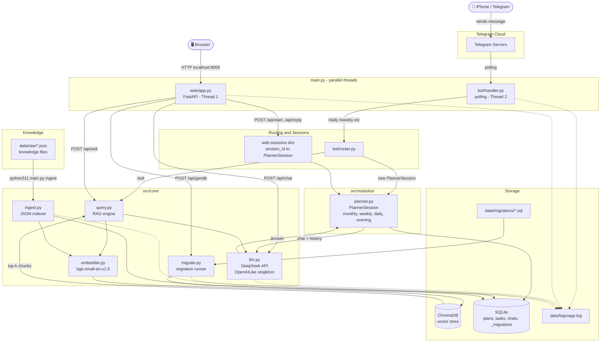

# System Flowchart

## Entry points

| Command | What starts |
|---|---|
| `python311 main.py` | Both Telegram bot + Web UI (default) |
| `python311 main.py both` | Same as above |
| `python311 main.py bot` | Telegram bot only |
| `python311 main.py web` | Web UI only (`http://localhost:8000`) |
| `python311 main.py ingest` | Index JSON files into ChromaDB |
| `python311 main.py migrate` | Apply pending SQL migrations |
| `python311 main.py ask "..."` | One-shot RAG query (CLI) |

## Web UI sections

| Sidebar | Endpoint | What it does |
|---|---|---|
| 📅 Daily / 🌙 Evening / 📆 Weekly / 🗓 Monthly | `POST /api/start` then `POST /api/reply` | Planning coach session |
| 📊 Status | `GET /api/status` | Week progress summary |
| 💬 Free Chat | `POST /api/chat` | Direct DeepSeek, history stored in SQLite |
| 🔍 Ask Knowledge | `POST /api/ask` | RAG over indexed JSON files |
| 🗄 Run GenDB | `POST /api/gendb` | Apply pending migrations |
| 🗺 System Flow | — | Renders this diagram in the browser |

Render at [mermaid.live](https://mermaid.live) or with the VS Code Mermaid extension.
