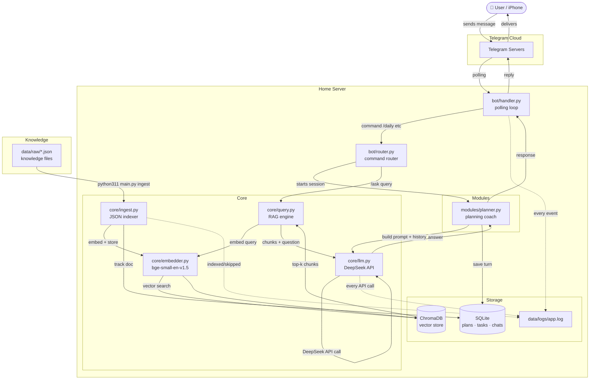

# System Flowchart

```mermaid
flowchart TD
    U([📱 User / iPhone])

    subgraph Telegram Cloud
        TG[Telegram Servers]
    end

    subgraph Home Server
        BOT[bot/handler.py\npolling loop]
        ROUTER[bot/router.py\ncommand router]

        subgraph Core
            LLM[core/llm.py\nDeepSeek API]
            RAG[core/query.py\nRAG engine]
            INGEST[core/ingest.py\nJSON indexer]
            EMB[core/embedder.py\nbge-small-en-v1.5]
        end

        subgraph Storage
            CHROMA[(ChromaDB\nvector store)]
            SQLITE[(SQLite\nplans · tasks · chats)]
            LOGS[data/logs/app.log]
        end

        subgraph Modules
            PLANNER[modules/planner.py\nplanning coach]
        end
    end

    subgraph Knowledge
        JSON[data/raw/*.json\nknowledge files]
    end

    U -->|sends message| TG
    TG -->|polling| BOT
    BOT -->|command /daily etc| ROUTER
    ROUTER -->|starts session| PLANNER
    PLANNER -->|build prompt + history| LLM
    LLM -->|DeepSeek API call| LLM
    LLM -->|answer| PLANNER
    PLANNER -->|save turn| SQLITE
    PLANNER -->|response| BOT
    BOT -->|reply| TG
    TG -->|delivers| U

    ROUTER -->|/ask query| RAG
    RAG -->|embed query| EMB
    EMB -->|vector search| CHROMA
    CHROMA -->|top-k chunks| RAG
    RAG -->|chunks + question| LLM

    JSON -->|python311 main.py ingest| INGEST
    INGEST -->|embed + store| EMB
    EMB --> CHROMA
    INGEST -->|track doc| SQLITE

    BOT -.->|every event| LOGS
    LLM -.->|every API call| LOGS
    INGEST -.->|indexed/skipped| LOGS
```

Render at [mermaid.live](https://mermaid.live) or with the VS Code Mermaid extension.
